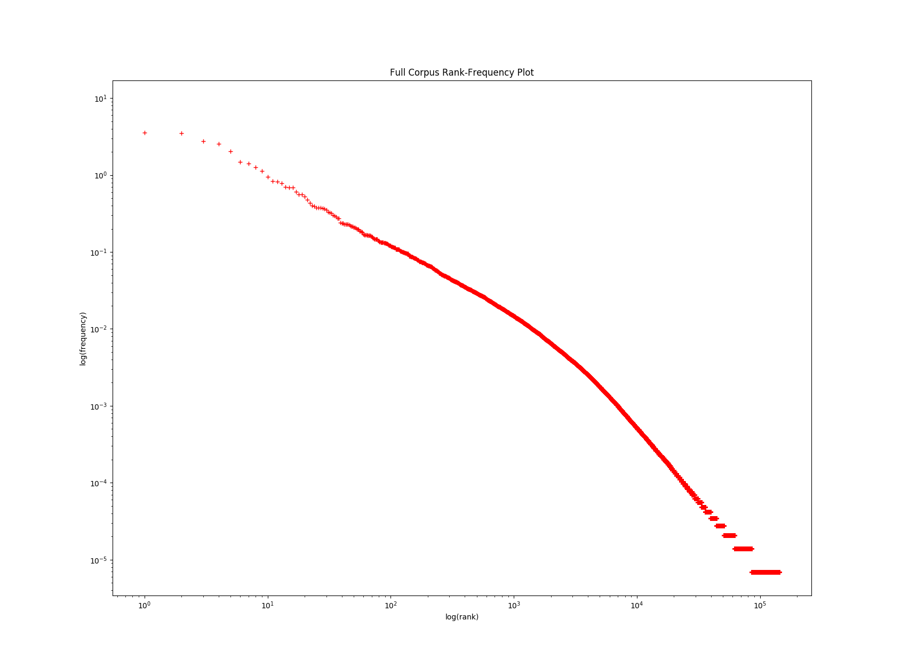
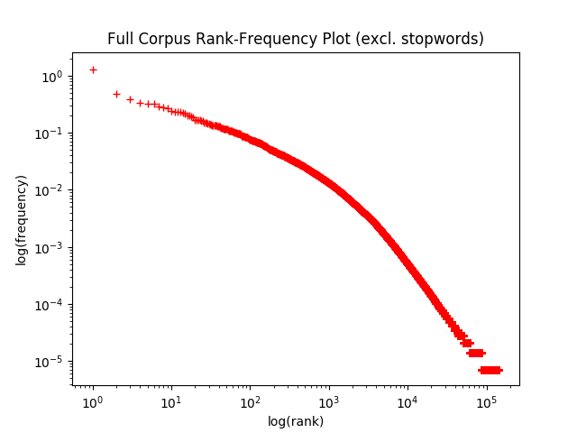
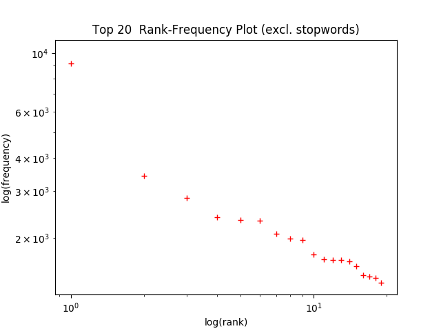

# Homework 1
### Spencer Hann
### CS 562 Winter 2019

## Part 1: Reading some data

1. My program for Part 1 is saved as `homework1/p1read_data.py` in this repo.
2. ```
Mainland Chinese Foreign Minister Qian Qichen
was highly skeptical of Tokyo's explanations of the content of the
newly published US-Japan guidelines for defense cooperation when he
met Monday in Beijing with representatives of Japan's press.
Qian also said the time is not ripe yet for a trilateral official
dialogue among Washington, Beijing and Tokyo on defense, adding that
"scholarly discussion" would be appropriate at the present.
Qian's remarks indicate that despite explanations of the new
guidelines by Japanese Prime Minister Ryutaro Hashimoto and Foreign
Minister Keizo Obuchi, Beijing is still very worried about whether
Taiwan falls within the sphere of the bilateral defense agreement.
According to reports in the Japanese media, among Qian's concerns
are:
-- If the defense pact is a matter between Washington and Tokyo,
it should be unnecessary to renew it, hence putting its content into
doubt.
-- Although the new guidelines do not specifically mention
geographic criteria, there is still speculation that they cover
Taiwan.
-- Some have argued for raising the transparency of the bilateral
agreement, while others advocate keeping it ambiguous and opaque.
The American Chamber of Commerce (AmCham) in
Taipei on Wednesday appealed for an early conclusion of trade
consultations between the United States and the Republic of China on
terms for Taiwan to join the World Trade Organization (WTO).
AmCham President Jeffrey R. Williams told a news conference that
all AmCham members hope bilateral ROC-US WTO talks will be concluded
as soon as possible to facilitate Taiwan's entry to the Geneva-based
world trade regulatory body.
According to Williams, most American business people with
interests in Taiwan are convinced that they will benefit from
Taiwan's WTO accession because Taiwan would be required to further
open its market and better protect intellectual property rights.
Williams, who just returned from a "doorknocking" visit to
Washington, D.C. at the head of a 12-member AmCham delegation, said
the US executive branch agreed with AmCham that Taiwan's WTO
accession should not be linked to mainland China's membership
application.
"We agree that Taiwan's WTO entry should be considered completely
on the basis of its own economic conditions," Williams said, adding
that Taiwan is likely to conclude WTO-related trade consultations
with the United States before the end of bilateral WTO talks between
Washington and Beijing.
During its stay in the United States, the AmCham delegation met
with many Clinton administration officials and Congress members to
exchange views on ways to help American corporations upgrade their
overseas competitiveness.
Williams said the AmCham mission had urged various US federal
agencies to allow their senior officials to make frequent visits to
Taiwan to help boost bilateral trade and economic cooperation for
mutual benefits.
Even though the Clinton administration was busy preparing for
mainland Chinese President Jiang Zemin's planned visit to the United
States late this month, Williams said, many federal government
officials still showed keen interest in listening to AmCham's
suggestions and opinions about reinforcing Taipei-Washington trade
and economic ties.
As to the AmCham 1997-98 Taiwan White Paper, which he formally
unveiled at a news conference held in Washington, D.C. last Thursday,
Williams said the annual report mainly analyzed Taiwan's current
economic and investment climate as a reference for American companies
intending to invest in Taiwan, adding that the White Paper was not
aimed at criticizing any party.
The White Paper said Taiwan's restrictions on trade and
investment across the Taiwan Strait have not only hindered the
development of its own industries but have also discouraged
multinational business groups from setting up a foothold on the
island. It further claimed that the ROC government's master plan to
develop Taiwan into an Asia-Pacific operations center would remain a
pipe dream if Taiwan companies are not allowed to enter the vast
mainland market directly and obtain access to its resources.
Williams said AmCham's analysis was made purely from a commercial
viewpoint, adding that AmCham members believe Taiwan must establish
direct communications and transport links with mainland China so that
Taiwan-based companies can make successful inroads into the world's
largest market.
Evergreen's green-colored ships and green
matchbox-like containers are the hope of the port of Gioia Tauro in
southern Italy.
Taiwan-based Evergreen Marine Corp., which operates one of the
largest container fleets in the world, is wagering on Gioia Tauro, a
newly-developed and non-urban port area, attempting to build it into
the third largest container port in the world.
Evergreen is also targeting Gioia Tauro as a gateway to all
Mediterranean-rim states and the Black Sea to the north, said a
company spokesman.
The Italian government has put up nearly US$180 million since
1975 to develop the quiet backwater fishing port into a commercial
harbor. With most parts of the development already finished, the
harbor accommodated some 1,270 ships in the first six months of this
year. The harbor bureau there estimated that its transshipment
capacity may reach 1.4 million TEUs this year.
Although the port is fully operational, its peripheral facilities
are still in dire need of help, Aldo Alessio, mayor of Gioia Tauro,
lamented. He noted that many support works have been left unfinished
due to budget constraints, with highways in the vicinity only four
meters wide and the nearby hinterland remaining undeveloped and
blanketed by weeds.
Taipei's representative office in Rome, which has generally been
reluctant to beckon Taiwan investors to Italy for fear that the
```
3. Fortunately, I did not encounter any serious bugs in this program.
I made sure to read the `lxml.etree` documentation before getting started.
The documentation had everything I needed so it ended up being pretty easy to use.
The only small problem I had was not checking for `None`, which caused the program to crash, but that was easy to fix with and `if` statement.

## Part 2: Structuring the data

1. According to my tokenization script, the CNA-GW corpus has 552,517 sentences.

## Part 3: Counting and comparing
### Word counting & distribution

1. Number of types:   144336
2. Number of tokens:  16474259
3.    
4. ```
Top 20 words:
	incl. stopwords
1	the
2	to
3	of
4	and
5	in
6	a
7	that
8	taiwan
9	said
10	for
11	on
12	will
13	with
14	is
15	at
16	as
17	by
18	he
19	be
20	from
```
5. The number of types decreases slightly (by the number of stopwords), but the numer of tokens decreases durastically.
Number of types:   144198
Number of tokens:  10092980

6. ```
Top 20 words:
	excl. stopwords
1	taiwan
2	said
3	china
4	percent
5	government
6	also
7	chen
8	president
9	year
10	taipei
11	nt
12	two
13	mainland
14	people
15	us
16	new
17	chinese
18	according
19	party
20	economic
```


### Word association metrics
